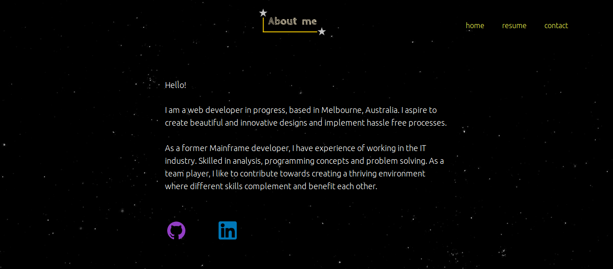
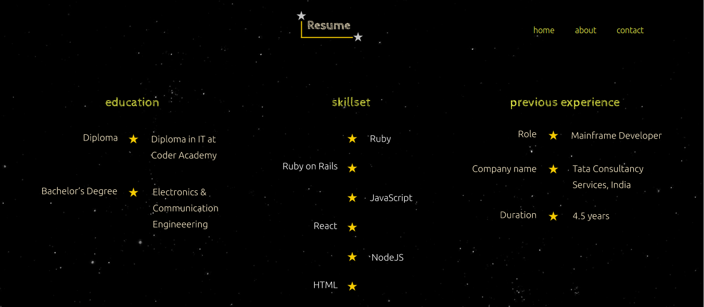
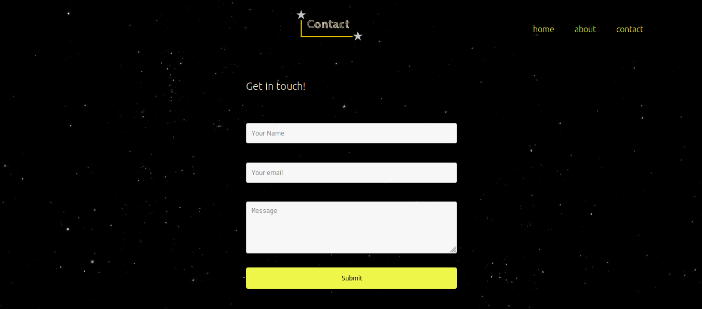
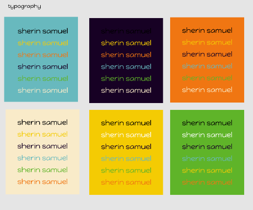
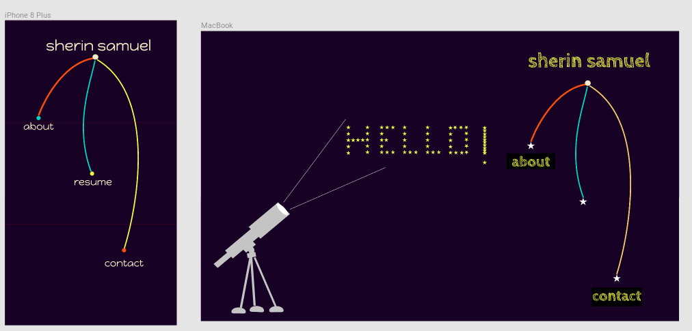
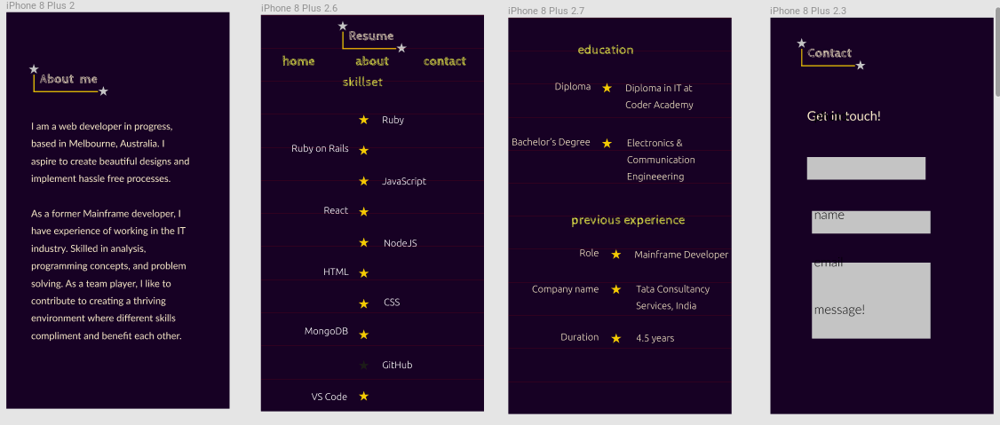
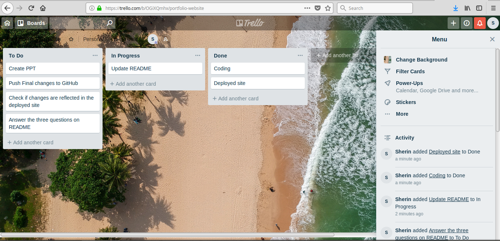

## Links 

[Deployed portfolio site](https://portfolio-sherinsamuel.netlify.com/)

[Portfolio on GitHub](https://github.com/SherinSam/portfolio)

## Description of website

### Purpose
The aim is to build a responsive website that showcases my talents, abilities and coding experience.
### Functionality / features
The website gives a brief idea of my skills, education, previous experience, links to my LinkedIn and GitHub profiles. It also provides a contact form for prospective employers to reach me.
### Sitemap
The home page gives links to the other three pages. There is a navigation bar on every page with links to every other page. 

1. Home page : Has links to other pages.
2. About me  : Gives a short intro to myself.
3. Resume    : Gives details on my skillsets, education and previous experience.
4. Contact   : Contact form for reaching out to me.
### Screenshots

Home Page

About Page

Resume Page

Contact Page

### Target audience
Prospective employers and those who would like to know about my work and skills are the target audience.

### Tech stack
The programming languages used are :
1. HTML
2. CSS

The online platforms used are:
1. Figma
2. Netlify
3. Github 

## Design documentation

### Design process
1. Creation of a moodboard of pictures with desirable colour combinations.
2. Choosing a colour palette for the site from the moodboard.
3. Choosing typography by trying various fonts on the chosen colours.
4. Wireframing the designs on Figma.
5. Generating the required SVG images from Figma.

### Wireframes
Moodboard & Color Palette

Typography

Wireframe-1

Wireframe-2

### Usability considerations
The various pages are on different HTML documents to make certain animations work without JavaScript.

## Details of planning process

### Project plan & timeline

* 17-Sep-2018 : Chalked out content for the website
* 18-Sep-2018 : Fixed color palette & typography. Started designing on Figma
* 19-Sep-2018 : Completed wireframes and started coding.
* 20-Sep-2018 : Coding in progress
* 21-Sep-2018 : Coding in progress. Tested contact form by deploying the site.
* 25-Sep-2018 : Presentation  
### Screenshots of Trello board

## Short Answer Q&A 
### 1. Describe key events in the development of the internet from the 1980s to today.
* 1982: TCP/IP emerge as the protocol for ARPANET. 
* 1983: DNS establishes the familiar .edu, .gov, .com, .mil, .org, .net, and .int system for naming websites. 
* 1985: Symbolics.com becomes the first registered domain.
* 1986: NSFNET goes online to connected supercomputer centers at 56,000 bits per second.
* 1987:. Cisco ships its first router.
* 1989: World.std.com becomes the first commercial provider of dial-up access to the Internet.
* 1990: Tim Berners-Lee, a scientist at CERN, develops HyperText Markup Language (HTML). 
* 1991: CERN introduces the World Wide Web to the public.
* 1992: The first audio and video are distributed over the Internet. 
* 1994: Microsoft creates a Web browser for Windows 95.
* 1998: The Google search engine is born.
* 1998: The Internet Protocol version 6 introduced, to allow for future growth of Internet Addresses. The current most widely used protocol is version 4. 
* 1999:  NTT DoCoMo in Japan launched the first mobile Internet service, i-mode, which is considered the birth of the mobile phone Internet services. 
* 2000: The dot-com bubble bursts.
* 2003: Myspace, Skype and the Safari Web browser debut.
* 2004:  Mozilla unveils the Mozilla Firefox browser.
* 2006: The Internet Governance Forum meets for the first time.
* 2016: Google unveils Google Assistant, joining Amazon's Alexa, Siri from Apple, and Cortana from Microsoft.
        
### 2. Define and describes the relationship between fundamental aspects of the internet such as: domains, web servers, DNS, and web browsers
* **Internet domain**: collection of data describing a self-contained administrative and technical unit on the Internet. Global visibility of an Internet domain is provided for by the DNS service.

* **Web server**: a program that uses HTTP (Hypertext Transfer Protocol) to serve the files that form Web pages to users, in response to their requests. Dedicated computers and appliances may be referred to as Web servers as well.

* **Domain Name System(DNS)**: phonebook of the Internet. DNS translates domain names to IP addresses so browsers can load Internet resources.

* **web browser**: software program that allows a user to locate, access, and display web pages.

When a website is opened..
1. The end user opens a web browser and types in a URL.
2. The URL request is sent through their LAN to their internet service provider. 
3. The internet service provider then sends the URL requested to an external DNS server.
6. The DNS server matches the URL requested to the internal IP address of the actual web server where the files making up the website are physically stored.
7. The request is then sent to the web server and the web server packages up the files that make up the website requested.
8. The website that is all packaged up now makes the return trip in reverse all the way back to the computer that originally made the request.
9. The web browser on that computer then interprets the text files full of computer code sent to it by the web server hosting the site and displays them as a graphic website.
        
### 3. Reflect on one aspect of the development of internet technologies and how it has contributed to the world today
The development of HTML by  Tim Berners-Lee, a scientist at CERN in 1990. 
* We cannot design a webpage without using HTML. That's how important HTML is. 
* Initially designed as a mark-up language to allow all Web pages to look the same across all platforms, it has evolved to make the Web what it is today. 
* The most recent iteration, HTML5, has brought even more dramatic changes with new media tags like audio and video, which make many of the bulky plug-ins used with previous versions obsolete.
* Early webmasters relied on complex hand-coding to create websites, but today's Web design software takes a what-you-see-is-what-you-get (WYSIWYG) approach, and with each new evolution of HTML, Web design gets a little easier. 
* Today, it's possible to build a complete, fully functioning website, without writing a single line of HTML, due to a drag-and-drop interface that automatically generates the HTML in the background.
* Apple's late Steve Jobs insisted that the iPhone would never use Flash, would support HTML5, and do away with the persistent problems of having to download plug-ins; other vendors quickly followed suit, and HTML5 is now supported by all major browser vendors, including Apple, Google, Firefox, Opera and Microsoft. This multivendor support appeals to developers, who no longer have to create multiple versions of their apps and websites.

